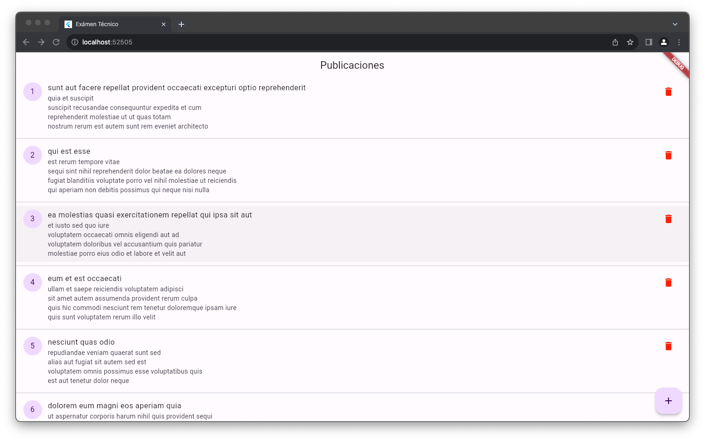
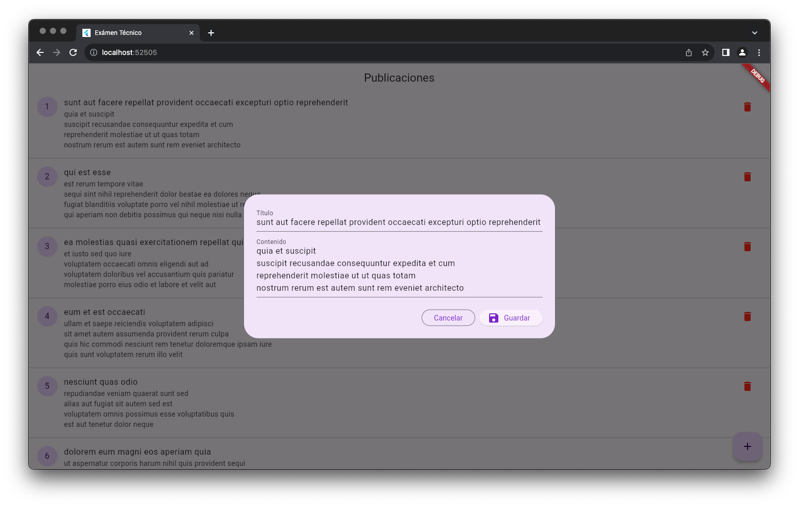
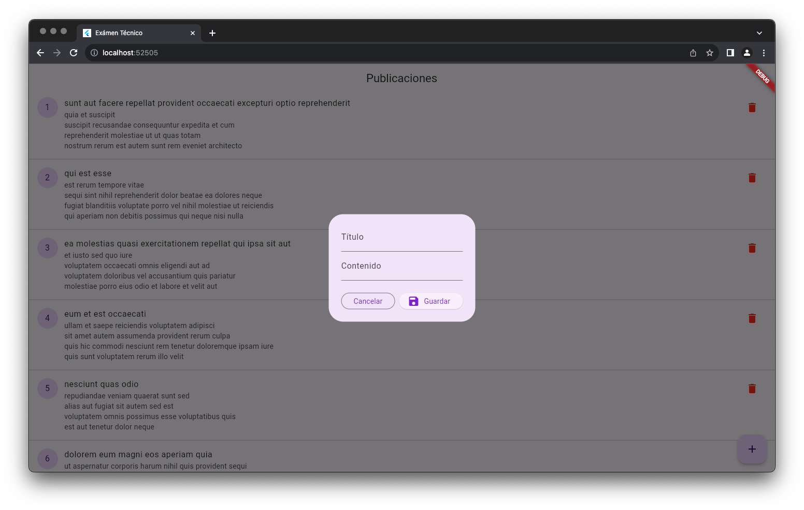

# Examen

Prueba Técnica Flutter - V++

## Instrucciones

1. Crear una pantalla que muestre un listado de publicaciones desde un recurso de internet.
2. Incluir un botón para mostrar un diálogo que permita crear una publicación.

   2.1. Se debe caprturar título y contenido de la publicación.

   2.2 Enviar el post a un método POST.``

   2.3 Al crear una publicación la lista principal deberá actualizarse (Preferible agregar al inicio de la lista).

   2.4 EL formulario de creación deberá estár validado con los campos como requeridos.
4. Al seleccionar una publicación se deberá mostrar un diálogo con los detalles de la publicación y podrán editarse.

   3.1. Enviar los datos editados a un método PUT.

   3.2. Al guardar la publicación el listado principal deberá actualizarse.
6. Incluir un botón de eliminar publicación.

   4.1. Consumir un método DELETE para eliminar.

   4.2. Al eliminar, actualizar el listado de publicaciones.

## Servicio Web

- La documentación del servicio web a consumir se encuentra en: https://jsonplaceholder.typicode.com/guide/.
- El userId puede ser siempre igual a 1.
- El servicio POST responde una respuesta exitosa con código 201.
- La información del servicio web no es persistente.
- Se puede utilizar cualquier manejador de estado si se desea.

## Ejemplo

### Litado de publicaciones

### Detalle y edición de publicación

### Creación de nueva publicación

